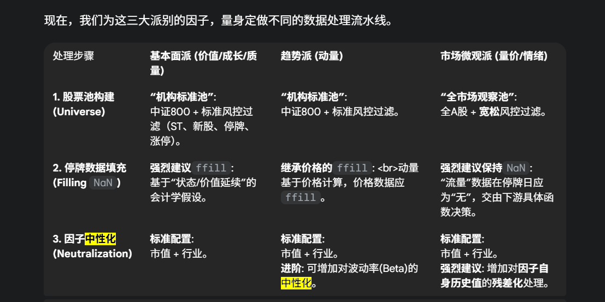

外加一些特殊类别。

--基本面派 (Fundamental School)

    包含: VALUE (价值), GROWTH (成长), QUALITY (质量), 以及其他广义的FUNDAMENTAL。

    核心逻辑: 基于上市公司的财务报表和经营状况，寻找价值被低估、成长性好或经营稳健的公司。信号频率较低（季度更新）。
    
--趋势派 (Trend School)

    包含: MOMENTUM (动量) 及其衍生因子。

    核心逻辑: 基于行为金融学，认为价格或盈利趋势具有一定的“惯性”。信号频率中等（月度更新）。
    
--市场微观派 (Market Microstructure School)

    包含: VOLATILITY (波动率), LIQUIDITY (流动性), SENTIMENT (情绪), 以及其他大部分TECHNICAL指标。

    核心逻辑: 基于市场每日的交易数据（量价），捕捉由交易者行为、市场情绪、流动性风险等因素驱动的短期投资机会。信号频率较高（日度、周度更新）。
    短期

关于 1. 股票池构建
    基本面/趋势派: 这类因子我们期望它们在主流的、可投资性强的股票中依然有效。使用“机构标准池”（比如中证800）是对它们进行的一次“压力测试”，能通过考验的才是真金。
    
    市场微观派: 这类因子的Alpha来源，很多时候正是源于小市值、低流动性股票中的“非理性”行为。如果用“机构标准池”可能会把这些Alpha来源大部分都过滤掉。因此，在研究这类因子时，应采用更宽泛的股票池（比如全A股，只进行最基础的ST、新股过滤），来保证不会“错杀”因子信号。

关于 2. 数据填充
    基本面/趋势派: 价值、质量、动量等因子，其数值的延续性是有经济学意义的。停牌期间，公司的基本面和长期趋势不会瞬间消失，因此用前一个交易日的值来填充（ffill）是合理的最佳实践。
    
    市场微观派: 换手率、成交量这类“流量”数据，在停牌日的真实值是0，与前一天的值毫无关系。在通用数据层，最严谨的做法是保持NaN，将“如何处理这个NaN”的决定权，交给下游具体的应用场景（比如，在流动性过滤时可以视为0，在计算换手率因子时则应忽略）。

关于 3. 因子中性化
    基本面/趋势派: 市值和行业是A股市场最主要的两个Alpha“污染源”。对任何因子先进行这两个中性化，是保证我们找到“纯净”Alpha的必要步骤。
    
    市场微观派 (重点！): 除了常规的市值和行业中性化，对这类因子进行**“残差化”**处理，是效果拔群的进阶技巧。
    
    逻辑: 比如换手率因子，我们关心的不是它今天的绝对值是5%还是10%，而是它今天5%的换手率，相对于它自己过去20天的平均水平（比如3%），高了多少。这个“异常增量” (5% - 3% = 2%) 才是真正包含新信息的信号。

    实现: abnormal_factor = factor_df - factor_df.rolling(20).mean()。用这个abnormal_factor去进行后续的测试。

 